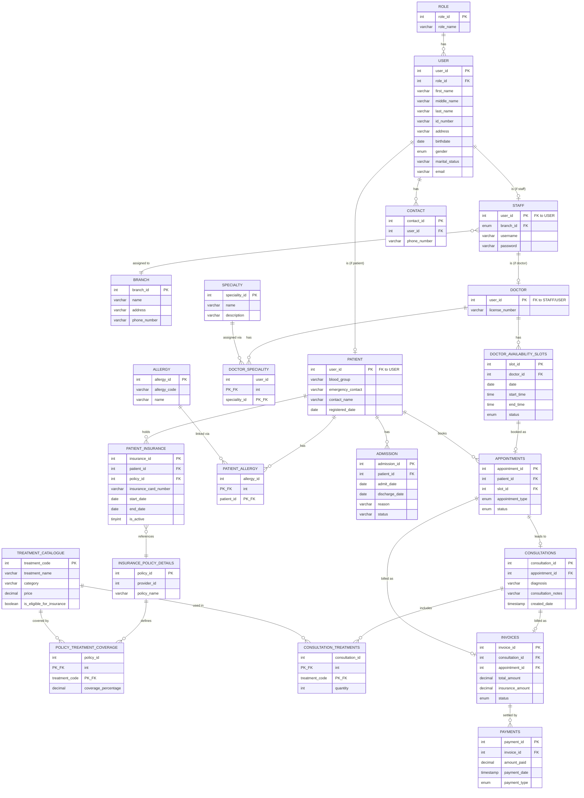

# MedSync CATMS — Architecture Document

> **Status note:** This document is generated from the project's *design and planning artifacts* — `requirments.txt` (assignment brief), the IEEE-format SRS draft, `architecture.md`, and the ER diagram — not from an inspected codebase. No source code was provided, so this describes the **planned/intended architecture**, not an audit of an implementation. Where the source documents conflict or leave something open, it is flagged explicitly rather than resolved silently.

---

## 1. System Overview

**What it does:** CATMS (Clinic+6 Appointment and Treatment Management System) digitizes appointment booking, treatment recording, and billing for MedSync, a multi-specialty clinic with three branches (Colombo, Kandy, Galle) currently run on paper records and Excel sheets.

**Domain purpose:** Replace fragmented, per-branch manual record-keeping with a single centralized system so that patient records, doctor schedules, treatments, and billing are consistent and accessible across all branches.

**Target users (role-based):**
| Role | Focus |
|---|---|
| System Administrator | Branch setup, staff/doctor registration, system-level configuration |
| Branch Manager | Branch-level reporting and oversight (appointments, revenue, outstanding balances) |
| Doctor | Daily schedule, consultation notes, prescribing treatments on completed appointments |
| Receptionist | Patient registration, appointment booking/reschedule/cancel, walk-ins |
| Patient | View own appointments, invoices, outstanding dues |

**Major capabilities:** patient registration (branch-independent), appointment booking/reschedule/cancel with overlap prevention, walk-in appointments, consultation + treatment recording gated on appointment completion, invoice generation, full/partial payments with outstanding-balance tracking, insurance coverage calculation, and five management reports.

**Architecture style:** Classic three-tier, client-server, stateless REST API with JWT auth — a single centralized database shared by all branches (branch is a data attribute, not a separate deployment).

**Planned technologies:** React + TypeScript (frontend), FastAPI (backend), PostgreSQL (database), SQLAlchemy (ORM).

**Runtime environment:** Web application accessed via modern browsers (Chrome, Firefox, Edge, Safari) from clinic desktops/laptops/tablets at reception desks, manager offices, and consultation rooms.

**Major external dependencies:** None identified as third-party integrations in the source documents — insurance claims are modeled as internal coverage-percentage calculations against a stored policy, not a live call to an external insurer API. No such API is described, so this should be treated as **not determined / not in scope for phase 1**.

```
┌─────────────┐      HTTPS/JSON       ┌──────────────┐      SQL       ┌───────────────┐
│  React + TS │  ───────────────────▶ │   FastAPI    │ ─────────────▶ │  PostgreSQL   │
│  (frontend) │ ◀─────────────────── │   backend     │ ◀───────────── │               │
└─────────────┘     REST + JWT        └──────────────┘   SQLAlchemy   └───────────────┘
```

---

## 2. Architecture Principles

Only principles actually reflected in the source documents:

- **Separation of concerns:** business logic lives in a `services/` layer, not in route handlers, per `architecture.md` §2, so it is reusable by report generation.
- **Single source of truth:** one centralized DB for all three branches rather than per-branch databases, so patient records are accessible everywhere (requirement in `requirments.txt`).
- **Database-enforced integrity over application-only checks:** ACID guarantees, FK/PK constraints, and critical business rules (no overlapping doctor appointments, treatments only on completed appointments) are pushed to the database layer via procedures/functions/triggers — explicitly required by the assignment brief and reaffirmed in SRS §2.5 and §5.4.1.
- **Role-based access control:** UI rendering and route guards filter by JWT-decoded role (`architecture.md` §4; SRS §4.1).
- **Independent restartability:** backend and database must be separately restartable, so DB migrations are a distinct explicit step, not coupled to backend startup (`architecture.md` §5, tied to SRS §2.4.3's uninterrupted-operation requirement).
- **Progressive containerization:** only the DB is containerized in early development; full-stack Docker Compose is introduced only for the final/presentation phase (`architecture.md` §5).

---

## 3. Technology Stack

| Layer | Technology | Version | Purpose |
|---|---|---|---|
| Frontend | React + TypeScript | Not specified | Web UI |
| Backend | FastAPI | Not specified | REST API |
| Database | PostgreSQL | 16 | Primary datastore |
| Authentication | JWT (bearer token) | Not specified | Stateless session auth |
| ORM | SQLAlchemy | Not specified | Python ↔ PostgreSQL mapping |
| Build tools | Not determined from the current documents | — | — |
| Testing | Not determined from the current documents | — | — |
| Deployment | Docker / Docker Compose (final phase only) | Not specified | Local demo/presentation packaging |
| Infrastructure | Local Docker for dev DB; one shared cloud PostgreSQL instance for integration testing | Not specified | Dev/test environments |


## 4. Backend Architecture (planned)

- **Framework:** FastAPI.
- **Structure:** one router per module (table in §4), each with its own request/response schemas; business logic isolated in a `services/` layer so it's testable and reusable by report generation.
- **Data access:** SQLAlchemy ORM against PostgreSQL.
- **Auth:** JWT bearer token required on every request after login (mechanism detailed in §10).
- **Role enforcement:** server-side authorization by role (Administrator, Branch Manager, Doctor, Receptionist, Patient) — SRS FR-UAC-04/05 require permission assignment and prevention of out-of-role access, though the specific enforcement mechanism (middleware vs. per-route dependency) is **not determined from the current documents**.
- **Background jobs, logging, external services:** not determined from the current documents.

Planned request lifecycle (inferred from stated principles — not confirmed against code):

```
HTTP Request → JWT Auth Check → Route Handler → Request Validation
    → Service Layer (business logic) → SQLAlchemy → PostgreSQL
    → Response
```

---

## 5. Frontend Architecture (planned)

```
/frontend/src
  /pages          one folder per sidebar module
  /components     shared UI (tables, forms, modals, sidebar, topbar)
  /api            typed fetch wrappers per backend router
  /auth           JWT storage, route guards, role-based nav filtering
```

- **Framework:** React + TypeScript.
- **Auth handling:** JWT stored client-side (storage mechanism not specified); route guards read the decoded role and hide/disable modules the current role can't use.
- **Role-based rendering:** sidebar and routes differ per role (Admin, Branch Manager, Doctor, Receptionist, Patient) per SRS §2.3/3.1.
- **State management, forms, validation, error/loading states, styling system, specific dependencies:** not determined from the current documents.

---

## 6. Database Architecture

**Technology:** PostgreSQL 16. PostgreSQL is ACID-compliant by default (MVCC + WAL) with no storage-engine choice to make — every table gets transactional guarantees, row-level locking, and FK enforcement out of the box. (The SRS §2.4.3 reference to "postgrace 8.x" with an InnoDB engine was a typo/leftover from a MySQL-oriented template and has been corrected — the project uses PostgreSQL 16, no separate storage-engine selection applies.)

### Entity-Relationship Diagram

Reconstructed from the provided ER diagram image:



**Design notes drawn from the diagram and requirements:**

- `USER` is the shared identity table for everyone (`ROLE` distinguishes Admin/Branch Manager/Doctor/Receptionist/Patient); `STAFF`, `DOCTOR`, and `PATIENT` extend it 1:1, so a doctor row exists in `USER` → `STAFF` → `DOCTOR`.
- Multi-specialty doctors are modeled as a many-to-many `DOCTOR_SPECIALITY` join table, matching the requirement that a doctor "can serve in more than one specialty."
- Appointment/slot separation (`DOCTOR_AVAILABILITY_SLOTS` ↔ `APPOINTMENTS`) is the structural mechanism for preventing overlapping bookings for the same doctor — a slot can be booked by at most one appointment.
- Treatments only attach to a `CONSULTATIONS` row, and `CONSULTATIONS` links to `APPOINTMENTS` — matching the rule that treatments/consultation notes are recorded only once an appointment is `Completed`.
- Insurance coverage is looked up per treatment via `POLICY_TREATMENT_COVERAGE` (policy × treatment → coverage %), which is what `INVOICES.insurance_amount` would be computed from.
- `PATIENT_INSURANCE` links a patient to a specific `INSURANCE_POLICY_DETAILS` row and tracks `is_active` — supporting the "if a patient is insured" conditional coverage logic.
- Partial/full payment tracking is modeled as one-to-many `INVOICES` → `PAYMENTS`, with outstanding balance derived (total_amount − insurance_amount − sum(payments)), consistent with FR-BPM-08 in `architecture.md` §3.

**Transactions, migrations, seed data, indexing specifics, cascade behavior:** not determined from the current documents beyond the transaction *boundaries* below (§8) and the general indexing directive in §11.

---

## 7. Transaction Boundaries (ACID enforcement points)

Per `architecture.md` §3, mapped to stored procedures/triggers at the DB level:

| Operation | Transaction scope | Requirement traced |
|---|---|---|
| Book/reschedule appointment | Check-then-insert (`SELECT ... FOR UPDATE` or stored procedure) in one transaction, to prevent two receptionists double-booking the same slot | Overlap-prevention rule in `requirments.txt` |
| Complete appointment → generate invoice | Appointment status update + consultation record + treatment lines + invoice row, all-or-nothing | FR-DMI-05, FR-DMI-06 |
| Record payment | Payment insert + invoice outstanding-balance recalculation + status flip to `Paid`, one transaction | FR-BPM-08 |

---

## 8. Business Workflows / Data Flows

Only flows described in the source documents:

**Appointment booking**
1. Receptionist (or patient, if patient-facing booking exists — not confirmed) selects doctor, branch, and slot.
2. System checks the slot isn't already booked for that doctor (no overlaps).
3. Appointment created with status `Scheduled`.

**Emergency walk-in**
1. Staff creates an appointment directly, without a prior booking step.
2. Same overlap-prevention rule applies.

**Reschedule**
1. Staff selects a new available slot for an existing appointment.
2. Old slot is freed, new slot is booked, within one transaction.

**Complete appointment → treatment → billing**
1. Doctor marks appointment `Completed`.
2. Doctor records consultation notes and/or one or more treatments from the catalogue.
3. System generates an invoice from the recorded treatments/consultation.
4. If the patient has active insurance covering any treatment, the invoice's insurance portion is computed from `POLICY_TREATMENT_COVERAGE`.

**Payment**
1. Patient makes a full or partial payment against an invoice.
2. Outstanding balance is recalculated; invoice status updates accordingly.

**Reporting** (five reports, read-only, driven by the `reports` router / services layer):
1. Branch-wise daily appointment summary (scheduled/completed/cancelled).
2. Doctor-wise revenue.
3. Patients with outstanding balances.
4. Treatment counts per category over a period.
5. Insurance coverage vs. out-of-pocket payments.

Sequence/architecture-level detail (exact API calls, DB queries) is **not determined from the current documents** — no code or API spec was provided.

---

## 9. Authentication & Authorization

From `architecture.md` §1 and SRS §4.1 (FR-UAC-01 through FR-UAC-06):

- Stateless REST API; JWT bearer token required on every request after login.
- Auth handled by a dedicated `auth` router: login, JWT issue/refresh, session/lockout tracking.
- System access is denied without valid credentials (FR-UAC-03).
- Predefined roles: Administrator, Doctor, Receptionist, Branch Manager (and, per the user-classes section, Patient).
- Permissions are role-based; users are prevented from accessing functions/data outside their role (FR-UAC-04/05).
- Successful logins are timestamped for auditing (FR-UAC-06).
- Frontend route guards decode the JWT role claim and hide/disable unauthorized modules.

**Not determined from the current documents:** password hashing algorithm, token expiry/refresh mechanics, logout behavior, lockout thresholds.

---

## 10. Security Architecture

Requirements stated in SRS §5.3, not yet implementation:

- **Patient data privacy (5.3.3):** personal details, emergency contacts, and insurance information restricted to authorized medical/administrative staff.
- **Encryption in transit (5.3.4):** all client↔server traffic, especially health/billing data, over HTTPS/TLS.
- **SQL injection prevention (5.3.5):** parameterized queries or secure stored procedures for all user-input-driven queries (patient search, appointment booking); direct DB access restricted to DBAs and the backend application itself.

**Recommendations (not stated as implemented, flagged as such):**
- No CSRF, secure-headers, or secrets-management approach is described — worth defining explicitly given JWT + browser clients.
- No rate limiting is mentioned despite a 100-concurrent-user NFR target.

---

## 11. Non-Functional Requirements (from SRS §5.1, §5.4)

| Requirement | Target |
|---|---|
| Login | ≤ 2s |
| Record retrieval | ≤ 3s (95th percentile) |
| Reports | ≤ 10s |
| Transactional writes | ≤ 5s |
| Concurrent users | 100 minimum |
| Reliability | ACID-compliant transactions; rollback on failure without leaving inconsistent state |
| Maintainability | Modular architecture; documented schema/API |
| Scalability | New branches/doctors/specialties/patients/treatments added without structural rework |
| Usability | Consistent UI, input validation, meaningful error/confirmation messages |

**Performance design implication** (`architecture.md` §6): connection pooling on the SQLAlchemy engine, and indexes on every column used in a WHERE/JOIN for search or reporting.

---

## 12. Deployment Architecture (planned)

| Phase | What's containerized |
|---|---|
| 1–4 (dev) | Only `db` (+ `pgadmin`) via Docker — identical PostgreSQL across every developer's machine. Backend runs via `uvicorn --reload`; frontend via `npm run dev`; both point at the containerized DB. |
| 5 (final/presentation) | `backend` and `frontend` each get a `Dockerfile`; commented-out blocks in `docker-compose.yml` are enabled so `docker compose up -d --build` brings up DB + API + UI on any machine with one command. |

**Rationale given in `architecture.md`:** containerizing the DB early removes schema-drift ("works on my machine") risk immediately at low cost; containerizing backend/frontend early adds reload/rebuild friction with no benefit until presentation day.

**Not determined from the current documents:** actual hosting provider, domains, CI/CD pipeline, health checks, scaling configuration beyond the connection-pooling/indexing notes in §12.

---

## 13. Discrepancies to Resolve

1. **Patient self-service portal:** the SRS's user-classes section describes patients viewing their own appointments/invoices directly ("e.g., through a web portal"), but the frontend module list in `architecture.md` doesn't explicitly confirm a patient-facing UI beyond role-based nav filtering. Worth confirming scope for phase 1.

> Resolved: the earlier PostgreSQL version/engine mismatch (SRS referencing "postgrace 8.x" + InnoDB) was a typo/template leftover — the project uses PostgreSQL 16, and the SRS should be corrected to match.

---

## 14. Open Items (from SRS Appendix C — "To Be Determined")

- Exact treatment prices and service charges.
- Insurance coverage percentages and reimbursement rules.
- Final system deployment environment.
- Detailed user permission levels for each role.
- Expected system workload / max concurrent users beyond the 100-user floor.
- Additional reporting requirements from clinic management.

---

## 15. Summary

CATMS is planned as a three-tier web application (React/TypeScript → FastAPI → PostgreSQL) built around one centralized database shared across MedSync's Colombo, Kandy, and Galle branches. The architecture's center of gravity is the database layer: ACID-guaranteed transactions, FK/PK-enforced consistency, and stored procedures/triggers are the mechanism for correctness (no double-booked doctor slots, invoices only from completed appointments, atomic payment/balance updates), while the FastAPI service layer and React frontend are organized around role-based access for five user classes. The strongest documented risk isn't architectural complexity — it's that no code exists yet to validate against; the one open discrepancy left to confirm is whether a patient-facing self-service portal is in scope for phase 1 (§14).
